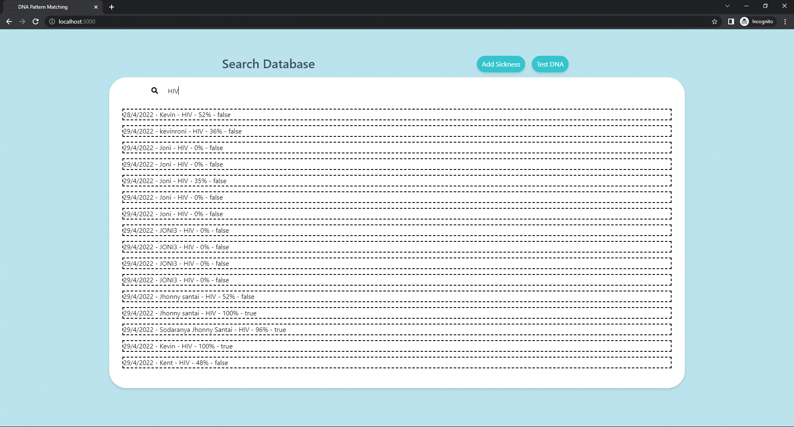
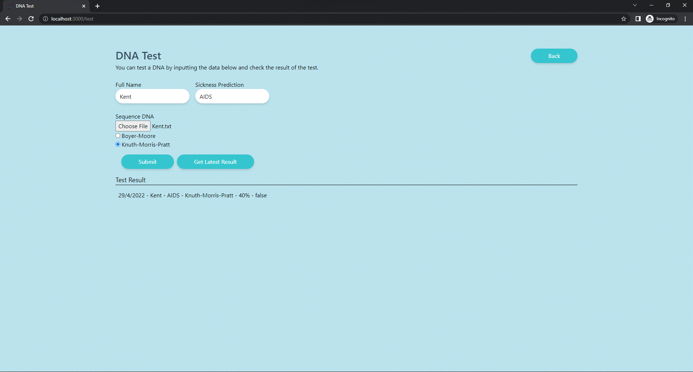
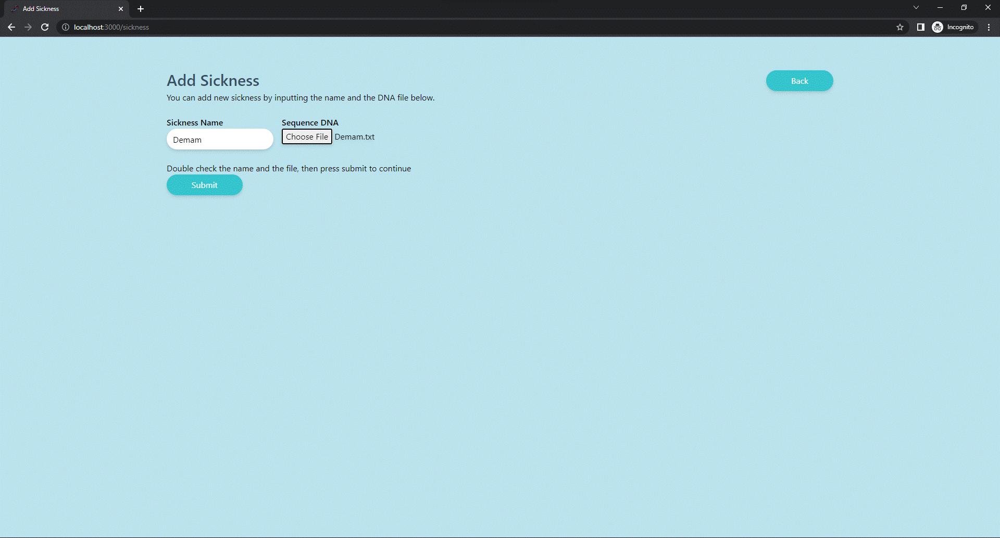

# Tugas Besar III IF2211 Strategi Algoritma

> Penerapan String Matching dan Regular Expression dalam DNA Pattern Matching.
> Live demo [_here_](https://dna.kentang.fun).

## Table of Contents

- [Tugas Besar III IF2211 Strategi Algoritma](#tugas-besar-iii-if2211-strategi-algoritma)
  - [Table of Contents](#table-of-contents)
  - [Technologies Used](#technologies-used)
  - [Features](#features)
  - [Screenshots](#screenshots)
  - [Setup](#setup)
  - [Usage](#usage)
  - [Author](#author)

## Technologies Used

- Next.js
- Golang
- PostgreSQL

## Features

- Aplikasi dapat menerima input penyakit baru berupa nama penyakit dan sequence DNA-nya (dan dimasukkan ke dalam database).
- Aplikasi dapat memprediksi seseorang menderita penyakit tertentu berdasarkan sequence DNA-nya.
- Aplikasi memiliki halaman yang menampilkan urutan hasil prediksi dengan kolom pencarian di dalamnya. Kolom pencarian bekerja sebagai filter dalam menampilkan hasil.
- (Bonus) Menghitung tingkat kemiripan DNA pengguna dengan DNA penyakit pada tes DNA.

## Screenshots





## Setup

```sh
git clone https://github.com/kentlius/Tubes3_13520069.git
cd Tubes3_13520069
```

- Frontend

  ```sh
  cd src/client
  ```

  ```sh
  npm install
  ```

- Backend

  ```sh
  go get .
  ```

  ```sh
  cd src/server
  ```

- Database
  - using docker
    ```sh
    cd src/server
    docker compose up -d
    cp .env.example .env
    ```
  - or download [PostgreSQL](https://www.postgresql.org/download/) then setup .env file

## Usage

1. Run Backend

```sh
go run cmd/main.go
```

2. Run Frontend

```sh
npm run dev
```

## Author

- 13520069 - Kent Liusudarso
- 13520114 - Kevin Roni
- 13520120 - Afrizal Sebastian
